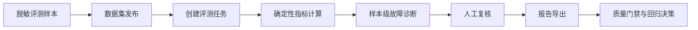

# RAGOps

<p align="center">
  <strong>RAG 应用质量评测与故障诊断平台</strong>
</p>

<p align="center">
  用工程化方式回答三个问题：RAG 现在答得好不好、失败样本为什么失败、这次改动能不能上线。
</p>

<p align="center">
  <a href="https://github.com/JichaoChen1123/RAGOps/actions/workflows/ci.yml">
    
  </a>
  
  
  
  
</p>

---

## 30 秒看懂

RAGOps 是一个面向 RAG 系统的质量控制台。它把评测数据集、模型版本、Prompt 版本、检索证据、指标计算、失败诊断、人工复核和报告导出串成一条可复现的链路。

当前仓库交付的是可运行、可测试的工程化 MVP：

| 能力 | 当前状态 | 说明 |
| --- | --- | --- |
| Mock UI 演示 | 已完成 | 浏览器里可体验概览、数据集、评测任务、报告、样本诊断和主要按钮反馈。 |
| API MVP | 已完成 | FastAPI 提供数据集、样本导入、评测任务、复核状态和报告导出接口。 |
| 模型执行基础 | 离线实现 | provider-neutral 契约、mock 与 OpenAI-compatible 适配器、超时/重试/脱敏和外部调用安全门已完成离线测试；真实连接未执行。 |
| 确定性评测 | 已完成 | 支持 Recall@K、MRR@K、NDCG@K、Context Precision/Recall、Citation Hit Rate 等指标。 |
| 故障诊断 | 已完成 | 根据固定规则输出检索缺失、上下文污染、引用缺失等样本级归因。 |
| 工程质量门禁 | 已完成 | GitHub Actions 运行后端、前端、文档、fixture 和 Docker Compose 构建检查。 |
| 真实 RAG 基础设施 | 下一阶段 | 真实 LLM provider、向量库、Embedding/Rerank、LLM judge 和生产部署尚未接入。 |

> 重要边界：默认 `VITE_API_MODE=mock` 不会调用真实模型，也不会写入生产数据。它用于稳定演示产品链路和前端交互。真实 API 联调请使用 `VITE_API_MODE=api`。

> 集成验收状态：本地 API/SQLite/重启和浏览器主流程已实测，但诊断 `rule_id` 在前端被显示为 `unclassified`。修复并复测前不能宣称离线阶段全部通过，详见 [离线基础集成验收记录](docs/qa/offline-readiness-acceptance.md)。

## 目录

- [项目背景](#项目背景)
- [核心流程](#核心流程)
- [界面与功能](#界面与功能)
- [技术栈](#技术栈)
- [快速启动](#快速启动)
- [无 Docker 运行](#无-docker-运行)
- [API 验收路径](#api-验收路径)
- [质量检查](#质量检查)
- [Mock 和 API 边界](#mock-和-api-边界)
- [简历写法](#简历写法)
- [项目结构](#项目结构)
- [延伸文档](#延伸文档)

## 项目背景

真实业务中的 RAG 应用通常不是“一次上线就结束”。客服知识库、售后政策、企业制度、内部数据助手都会持续变更：文档会更新，切分策略会调整，Embedding 和 Rerank 会更换，Prompt 会迭代，模型版本也会升级。

这些变更带来三个很实际的问题：

| 现实问题 | 如果没有 RAGOps | RAGOps 的作用 |
| --- | --- | --- |
| 质量靠人工感觉 | 只能人工抽问几十条，样本不固定，结果不可复现。 | 固定评测集、指标和质量门禁，每次改动都能复测。 |
| 答错后定位慢 | 不知道是检索没召回、上下文污染、引用错误，还是模型幻觉。 | 对失败样本下钻到检索证据、引用和诊断规则。 |
| 改动上线风险高 | Prompt 或模型一改，旧问题可能被答坏但没人发现。 | 记录模型、Prompt、数据集和评测配置，用版本对比做回归判断。 |

这个项目解决的不是“怎么调用一次大模型”，而是“怎么把 RAG 应用的质量评估做成可运营、可追溯、可验收的工程系统”。

## 核心流程



核心链路：

```text
Dataset -> Evaluation Job -> Metrics -> Failure Diagnosis -> Review -> Report
```

每次评测都会保留：

- 数据集版本，例如 `客服黄金问答集 v3.4`
- 模型版本，例如 `qwen3-32b@2026-08`
- Prompt 版本，例如 `support-rag@v12`
- 指标结果，例如 Recall@K、NDCG@K、Citation Hit Rate
- 失败归因，例如检索缺失、上下文污染、引用不支持
- 人工复核状态，例如 pending、confirmed、dismissed
- 可导出的 JSON 或 Markdown 报告

## 界面与功能

| 页面 | 作用 | 能体现的工程能力 |
| --- | --- | --- |
| 项目概览 | 展示质量分、趋势、失败分布、最近任务和 RAGOps 技术链路。 | 指标聚合、质量门禁、版本上下文、产品化仪表盘。 |
| 数据集管理 | 支持搜索、筛选、创建、导入示例 JSONL、查看详情、复制 ID 和 Mock 归档。 | 数据集版本管理、样本资产管理、mock/API 双模式交互。 |
| 评测任务 | 按数据集、模型和 Prompt 创建任务，展示 queued、running、completed 状态。 | 任务状态机、幂等创建、评测运行追踪。 |
| 评测报告 | 展示聚合指标、失败分布、运行配置、失败样本列表和报告导出。 | 指标计算、报告生成、质量阈值判断、可审计输出。 |
| 样本诊断 | 对比问题、期望答案、模型回答、检索证据和引用支持，支持人工确认或排除。 | 证据链追踪、故障归因、人工复核闭环。 |
| 工作台外壳 | 侧边栏、搜索、帮助、数据场景、mock/API 状态、coming soon 和 disabled 状态。 | 产品边界表达、可用状态设计、可演示工作流。 |

默认 mock 演示页面：

| 页面 | 地址 |
| --- | --- |
| 项目概览 | <http://localhost:5173/projects/demo/overview> |
| 数据集管理 | <http://localhost:5173/projects/demo/datasets> |
| 评测任务 | <http://localhost:5173/projects/demo/evaluations> |
| 评测报告 | <http://localhost:5173/projects/demo/evaluations/eval-20260826/report> |
| 样本诊断 | <http://localhost:5173/projects/demo/evaluations/eval-20260826/samples/sample-042> |

## 技术栈

| 层次 | 技术 | 用在哪里 | 为什么使用 |
| --- | --- | --- | --- |
| 前端 | React、TypeScript、Vite、React Router | 工作台、路由、组件、状态页、交互弹窗、mock/API client。 | 轻量、类型安全、适合快速构建可测试的管理台 MVP。 |
| 后端 | FastAPI、Pydantic、Pydantic Settings | REST API、OpenAPI、参数校验、配置管理、统一错误结构。 | API 契约清晰，自动生成 Swagger UI，适合 AI 应用后端。 |
| 持久化 | SQLite、SQLAlchemy | 数据集、样本、任务、评测结果、复核状态。 | MVP 易部署，后续可平滑迁移到 PostgreSQL 或 MySQL。 |
| 评测 | Recall@K、MRR@K、NDCG@K、Context Precision/Recall、Citation Hit Rate | 衡量检索召回、排序、上下文质量、引用命中和端到端质量。 | 让质量判断从主观感受变成可复现指标。 |
| 诊断 | 版本化规则、证据链、置信度、严重级别 | 给失败样本输出故障原因和修复方向。 | 帮助定位应该修知识库、检索、Prompt 还是生成模型。 |
| 测试 | Pytest、Vitest、TypeScript、Ruff | 后端、评测、前端路由、交互、API client、代码风格。 | 用自动化证明功能不是静态展示。 |
| 交付 | Docker Compose、GitHub Actions | 本地一键启动、CI、镜像构建、文档和 fixture 校验。 | 方便别人克隆复现，也方便持续迭代。 |

## 快速启动

如果已经安装 Docker Desktop，并且 Docker Engine 正在运行：

```powershell
git clone https://github.com/JichaoChen1123/RAGOps.git
cd RAGOps
docker compose up --build
```

启动后访问：

- 前端工作台：<http://localhost:5173>
- 后端 Swagger UI：<http://localhost:8000/docs>
- 后端就绪检查：<http://localhost:8000/health/ready>

默认不需要 `.env`。如果要覆盖端口或运行模式：

```powershell
Copy-Item .env.example .env
docker compose up --build
```

停止服务并保留数据卷：

```powershell
docker compose down
```

同时清理本地数据卷：

```powershell
docker compose down --volumes
```

## 无 Docker 运行

适合 Docker 暂时不可用，或者只想验收前端 Mock UI。

### 准备环境

- Git
- Python 3.11+
- [uv](https://docs.astral.sh/uv/)
- Node.js 24+
- npm

确认版本：

```powershell
git --version
python --version
uv --version
node --version
npm --version
```

### 启动前端 Mock UI

PowerShell：

```powershell
npm --prefix frontend ci
$env:VITE_API_MODE = "mock"
npm --prefix frontend run dev
```

Git Bash：

```bash
npm --prefix frontend ci
VITE_API_MODE=mock npm --prefix frontend run dev
```

### 启动后端 API

```powershell
uv sync --project backend --extra dev --frozen
uv run --project backend ragops init-db
uv run --project backend uvicorn app.main:app --app-dir backend --reload
```

默认数据库文件是仓库根目录的 `ragops.db`。后端启动后访问：

- Swagger UI：<http://localhost:8000/docs>
- OpenAPI JSON：<http://localhost:8000/openapi.json>
- 就绪检查：<http://localhost:8000/health/ready>

### 启动本地 API 模式前端

先保持后端运行，再开一个 PowerShell 终端：

```powershell
$env:VITE_API_MODE = "api"
$env:VITE_API_BASE_URL = "/api/v1"
$env:VITE_API_PROXY_TARGET = "http://127.0.0.1:8000"
npm --prefix frontend run dev
```

顶部应显示“前端 API 数据 / 后端执行器 mock / 提供方未配置”。`VITE_API_MODE=api` 只表示浏览器连接 RAGOps 后端，不表示真实模型已连接。

## API 验收路径

在 Swagger UI 中按这个顺序验收真实 API MVP：

1. `POST /api/v1/datasets` 创建数据集。
2. `POST /api/v1/datasets/{dataset_id}/samples:import` 导入样本。
3. `POST /api/v1/datasets/{dataset_id}:publish` 发布并冻结数据集。
4. `POST /api/v1/evaluation-jobs` 创建评测任务。
5. `GET /api/v1/evaluation-jobs/{job_id}` 查询任务状态。
6. `GET /api/v1/evaluation-jobs/{job_id}/samples` 查看样本结果。
7. `PATCH /api/v1/evaluation-jobs/{job_id}/samples/{sample_id}/review` 更新复核状态。
8. `GET /api/v1/evaluation-jobs/{job_id}/report` 查看报告。
9. `GET /api/v1/evaluation-jobs/{job_id}/report/export` 导出结构化 JSON。
10. `GET /api/v1/model-execution/status` 查看不含秘密且不探测提供方的执行状态。

验收样本位于 [examples/eval-samples](examples/eval-samples/README.md)。完整 API 调用闭环可参考 `tests/backend/test_mvp_acceptance.py`。

## 质量检查

后端、评测、覆盖率与仓库契约：

```powershell
uv sync --project backend --extra dev --frozen
uv run --project backend ruff check --config backend/pyproject.toml backend/app tests scripts
uv run --project backend pytest -c backend/pyproject.toml tests/backend tests/evaluation -q --cov=app --cov-branch --cov-report=term-missing --cov-fail-under=85
uv run --project backend python scripts/validate_repository.py
```

前端：

```powershell
npm --prefix frontend ci
npm --prefix frontend run typecheck
npm --prefix frontend test
npm --prefix frontend run build
```

验收脚本：

```powershell
.\tests\fixtures\validate-fixtures.ps1
.\tests\acceptance\validate-wor-49.ps1 -RepoRoot .
.\tests\acceptance\validate-wor-55.ps1 -RepoRoot .
.\tests\acceptance\offline-readiness\validate-assets.ps1 -RepoRoot .
.\tests\acceptance\offline-readiness\run-local-restart.ps1 -RepoRoot .
node --check frontend/scripts/offline-readiness-browser.mjs
```

API 模式浏览器 E2E 分 `create`、`restart_recheck`、`disconnected` 三阶段执行；前置服务、环境变量和证据目录见 [浏览器检查表](tests/acceptance/offline-readiness/browser-checklist.md)。脚本的非零退出代表真实语义或控制台缺陷，不能只凭截图改写成通过。

CI 在 pull request 和 `main` push 上运行：

- Backend lint and tests
- Frontend typecheck, tests, and build
- Markdown, fixtures, and YAML
- Docker Compose build

## Mock 和 API 边界

| 模式 | 数据来源 | 写入行为 | 适用场景 |
| --- | --- | --- | --- |
| `VITE_API_MODE=mock` | 仓库内脱敏 fixture | 只修改当前浏览器内存，刷新后重置。 | 稳定演示 UI、交互状态和诊断链路。 |
| `VITE_API_MODE=api` | `VITE_API_BASE_URL` 指向的后端 | 调用真实 MVP API，数据写入 SQLite。 | API 契约联调、后端验收和二次开发。 |

### Mock 模式

Mock 模式用于稳定演示产品链路。它读取仓库内脱敏 fixture，支持创建、筛选、导出、复核等前端交互，但写入只保存在当前浏览器会话中，刷新页面后会重置。

### API 模式

API 模式用于真实 MVP 后端联调。它通过 `VITE_API_BASE_URL` 调用 FastAPI 服务，并把数据集、评测任务、样本复核和报告结果写入 SQLite。后端执行器由 `RAGOPS_MODEL_EXECUTION_ADAPTER` 独立选择；默认 `mock`，且 `RAGOPS_MODEL_EXTERNAL_CALLS_ENABLED=false` 会在任何真实网络路径之前拒绝调用。OpenAI-compatible 适配器只有离线 MockTransport 证据，没有真实连接证据。

### No silent fallback

API 请求失败时，页面必须显示错误或重试入口，不能静默回退到 mock 数据后显示成功。这条规则用于避免把演示数据误判为真实后端结果。

### 当前没有夸大的能力

当前版本仍是 MVP，不是生产级 RAG 平台。以下能力属于下一阶段：

- 真实 LLM provider 调用
- 真实向量数据库
- 文档解析、Embedding/Rerank、索引构建与召回服务
- LLM judge 自动评分
- 生产鉴权、多租户、任务队列、对象存储、可观测性和数据库迁移

现有数据库升级已具备 `0001_mvp_baseline -> 0002_model_execution_contract` 幂等迁移；这里的“生产数据库迁移”指更完整的回滚、备份恢复、跨数据库和零停机能力。

## 简历写法

可以按自己的真实参与范围取舍：

- 设计并实现 RAG 应用质量评测与故障诊断 MVP，打通数据集、评测任务、指标计算、样本诊断、人工复核和报告导出闭环。
- 使用 FastAPI、SQLAlchemy、Pydantic 与 SQLite 构建类型化资源 API，落地统一错误结构、健康检查和持久化模型。
- 实现带幂等键的评测任务创建与 `queued -> running -> completed` 状态流转，降低重复提交导致的任务污染。
- 实现 Recall@K、MRR@K、NDCG@K、Context Precision/Recall 和 Citation Hit Rate 等可审计的确定性 RAG 指标。
- 构建版本化故障诊断规则，输出原因、证据、置信度、严重级别、改进建议与不可判定状态。
- 使用 React、TypeScript、Vite 与 React Router 构建组件化诊断工作台，覆盖概览、数据集、任务、报告和样本证据页面。
- 设计 mock/API 双 client 与显式错误边界，保证演示数据和真实 API 结果不被静默混用。
- 建立 Pytest、Vitest、Ruff、TypeScript、覆盖率、fixture/文档校验和 Docker build 组成的 GitHub Actions 质量门禁。

## 项目结构

```text
backend/             FastAPI 服务、数据模型、评测与诊断逻辑
frontend/            React 工作台、路由、组件与 mock/API client
docs/                产品、架构、设计、评测、开发与 QA 文档
examples/            数据集 schema、脱敏样本和指标 oracle
tests/               后端、评测、前端与验收测试
docker/              前后端镜像和 Nginx 配置
docker-compose.yml   本地一键启动编排
```

## 延伸文档

| 文档 | 内容 |
| --- | --- |
| [克隆、配置与使用教程](docs/quickstart.md) | 从克隆到本地运行的完整步骤。 |
| [本地开发与排障](docs/development.md) | Docker、Windows、Git hook 和开发模式说明。 |
| [后端架构与 API](docs/architecture/backend.md) | FastAPI 模块、状态机、数据模型和接口边界。 |
| [前端设计](docs/design/frontend.md) | 工作台信息架构和页面设计。 |
| [线框图](docs/design/wireframes.md) | 核心页面布局说明。 |
| [评测指标](docs/evaluation/metrics.md) | 指标体系、数据模型和执行流程。 |
| [故障诊断规则](docs/evaluation/diagnosis-rules.md) | 失败归因规则和证据输出。 |
| [评测数据集格式](examples/datasets/README.md) | 数据集 schema 和样例。 |
| [可复现评测样本](examples/eval-samples/README.md) | 有效样本、异常样本和指标 oracle。 |
| [MVP 测试计划](docs/qa/test-plan.md) | 测试策略、验收标准和风险清单。 |
| [MVP 验收记录](docs/qa/mvp-acceptance.md) | MVP 验收和质量门禁记录。 |
| [功能回归验收记录](docs/qa/wor-52-functional-acceptance.md) | 按钮交互、API 和文档回归验收。 |
| [UI 与 README 二轮验收记录](docs/qa/wor-55-ui-readme-acceptance.md) | UI 一致性、技术表达和 README 验收。 |
| [离线基础集成验收记录](docs/qa/offline-readiness-acceptance.md) | 模型执行基础、迁移、本地 API、浏览器截图、Docker 限制和当前阻断。 |
| [测试目录说明](tests/README.md) | 测试结构和 fixture 自检。 |

## 下一阶段建议

如果要从 MVP 继续升级到更接近真实生产的 RAGOps 平台，优先级建议如下：

1. 接入真实文档解析、chunk 切分和索引构建。
2. 接入 Embedding/Rerank 与向量数据库，例如 FAISS、Qdrant 或 Milvus。
3. 修复诊断 `rule_id` 前端映射和重复 key，并将现有 API 模式浏览器脚本接入稳定 CI runner。
4. 在用户明确授权、secret 隔离和预算限制下接入真实 LLM provider，并记录 provider、model、Prompt、index 版本。
5. 增加跨浏览器截图回归，持续覆盖桌面和移动端视口。
6. 增加任务队列、鉴权、多租户、对象存储和可观测性。
