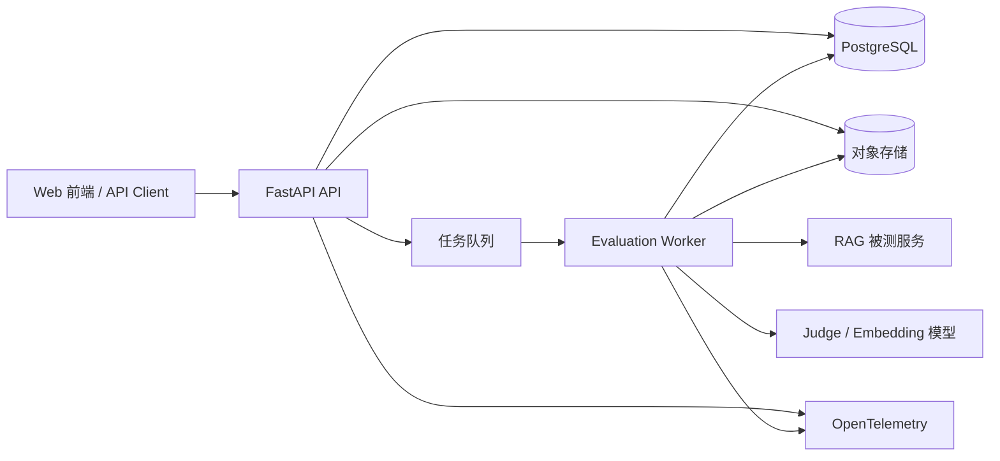
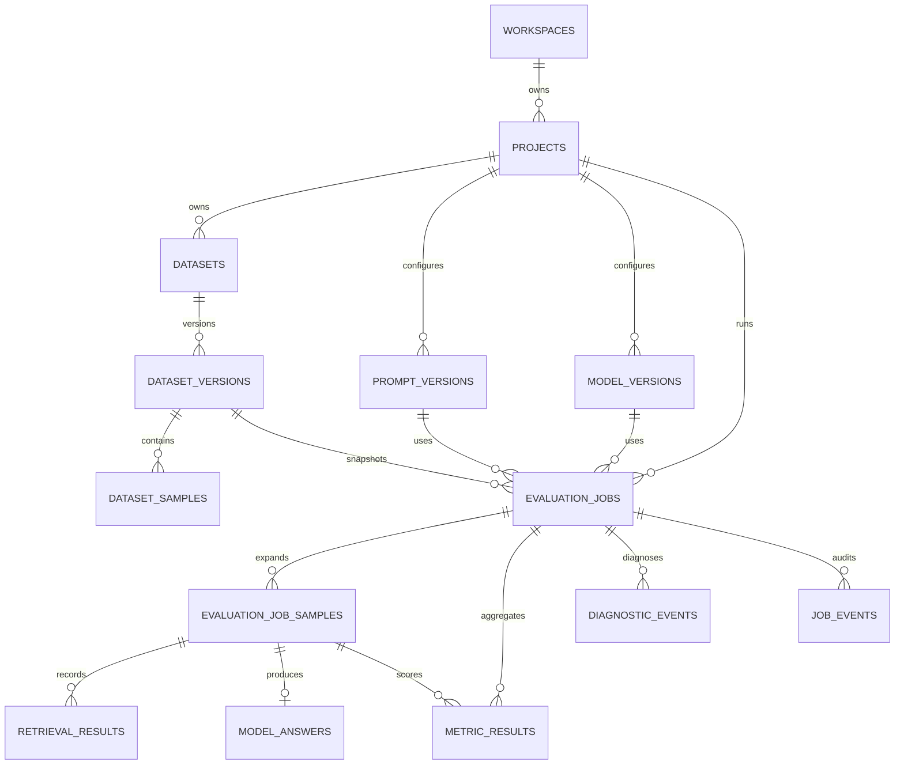
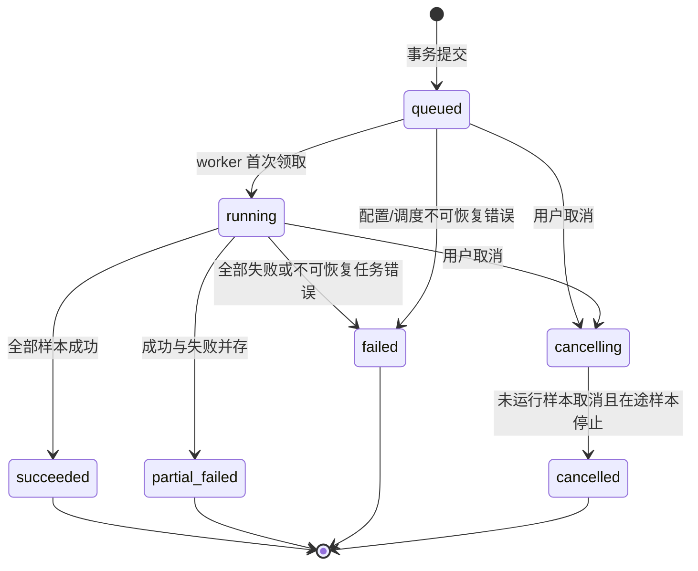

# RAGOps 后端平台架构

- 状态：MVP 设计基线
- 适用范围：质量评测、故障诊断、结果查询与指标看板
- 技术基线：Python 3.12、FastAPI、Pydantic v2、SQLAlchemy 2、PostgreSQL 16

## 1. 目标与设计原则

后端首先交付一个最小可运行闭环：创建项目和数据集、固化待评测版本、提交评测任务、异步执行、持久化逐样本结果和聚合指标、查询进度与诊断事件。看板、批量对比和高级调度均建立在这一闭环之上。

核心原则：

1. API 只接受不可变版本引用，评测开始后不读取“当前 Prompt”或“当前模型配置”，保证结果可复现。
2. PostgreSQL 是 MVP 的事实来源；任务状态、结果、诊断和审计信息不得只存在于内存或日志中。
3. 任务是至少一次投递，业务写入必须幂等；不把消息队列的投递成功等同于评测成功。
4. 同一任务允许部分样本失败，任务级状态和样本级状态分开建模。
5. API、worker、指标插件只通过稳定契约协作，避免算法实现侵入 Web 层。
6. 所有外部调用都带超时、限流、重试上限和可关联的 trace/request/job 标识。

MVP 不包含：多租户计费、复杂工作流编排、在线流量自动采样、跨地域容灾、指标插件市场。数据模型保留 `workspace_id`、版本和 JSON 扩展字段，便于后续演进。

## 2. 总体架构



建议进程边界：

- `api`：鉴权、参数校验、资源管理、任务提交、状态和结果查询，不执行耗时评测。
- `worker`：加载数据快照，调用被测 RAG、运行指标、写入样本和聚合结果。
- `dispatcher`：MVP 可由 worker 进程内循环实现，负责将数据库 outbox 投递到队列；生产环境独立部署。
- `scheduler`：后续负责周期评测、超时回收和保留策略，不进入首个闭环。
- PostgreSQL：元数据、状态机、结果、诊断、outbox 和审计事实来源。
- 对象存储：大数据集原文件、长文本原始响应和导出文件；数据库保存 URI、摘要和必要的查询字段。
- Redis + Celery/RQ：生产环境任务投递与 worker 横向扩展。MVP 本地模式可使用 PostgreSQL outbox + 单 worker，但 API 与 worker 仍保持独立进程。

## 3. 后端模块划分

建议仓库结构：

```text
backend/
  pyproject.toml
  alembic.ini
  app/
    main.py                    # FastAPI 组装与生命周期
    api/
      dependencies.py         # 会话、鉴权、分页依赖
      v1/
        projects.py
        datasets.py
        versions.py
        evaluation_jobs.py
        metrics.py
        diagnostics.py
    core/
      config.py                # pydantic-settings
      errors.py                # 领域错误到 HTTP 映射
      logging.py               # 结构化日志与脱敏
      telemetry.py             # trace/metric 初始化
      security.py
    domain/
      models.py                # 纯领域类型与状态枚举
      services/
        dataset_service.py
        evaluation_service.py
        result_service.py
      policies/
        retry_policy.py
        transition_policy.py
    schemas/                   # API Pydantic request/response
    persistence/
      db.py
      orm/                     # SQLAlchemy 映射
      repositories/            # 领域仓储
      migrations/              # Alembic
      outbox.py
    evaluation/
      contracts.py             # 算法输入/输出协议
      runner.py                # 单样本执行管线
      aggregation.py
      metrics/                 # 指标插件适配器
      diagnostics/             # 规则/模型诊断器
    workers/
      tasks.py
      dispatcher.py
      lease.py
tests/backend/
  unit/
  integration/
  contract/
  fixtures/
```

依赖方向为 `api -> domain <- evaluation`，`persistence` 实现 domain 约定的端口。API schema、ORM model 与领域模型分离，避免数据库字段或 HTTP 兼容性要求渗透到核心评测逻辑。

## 4. 核心领域模型与数据库 schema

### 4.1 通用约定

- 主键使用 UUID v7；服务端生成，便于分布式写入和按时间排序。
- 所有表包含 `created_at timestamptz not null`；可变资源增加 `updated_at`。
- 所有业务唯一约束都包含 `workspace_id`，为多租户隔离预留边界。
- 用户可编辑资源使用 `version bigint not null default 1` 做乐观锁。
- 可查询/关联字段使用独立列；非稳定扩展信息放 `jsonb`，不把整个领域对象塞入 JSON。
- 时间均存 UTC；API 使用 RFC 3339。
- 删除项目/数据集采用 `deleted_at` 软删除；已被任务引用的版本和快照禁止物理删除。
- 日志、Prompt、模型凭据和响应内容按字段分类脱敏；凭据只保存 secret reference，不保存明文。

### 4.2 关系图



### 4.3 资源与版本表

`projects`

| 字段 | 类型 | 约束/说明 |
|---|---|---|
| id | uuid | PK |
| workspace_id | uuid | NOT NULL |
| name | varchar(120) | NOT NULL |
| slug | varchar(80) | NOT NULL |
| description | text | NULL |
| default_locale | varchar(20) | 默认 `zh-CN` |
| settings | jsonb | 默认 `{}` |
| version | bigint | 乐观锁 |
| created_at / updated_at / deleted_at | timestamptz | 软删除 |

唯一索引：`(workspace_id, slug) WHERE deleted_at IS NULL`。

`datasets`

| 字段 | 类型 | 约束/说明 |
|---|---|---|
| id | uuid | PK |
| workspace_id / project_id | uuid | NOT NULL, FK |
| name | varchar(160) | NOT NULL |
| description | text | NULL |
| schema_version | varchar(20) | 样本契约版本 |
| latest_version_no | integer | 默认 0 |
| version | bigint | 乐观锁 |
| created_at / updated_at / deleted_at | timestamptz | 软删除 |

`dataset_versions` 是发布后不可变的评测快照。

| 字段 | 类型 | 约束/说明 |
|---|---|---|
| id | uuid | PK |
| dataset_id | uuid | NOT NULL, FK |
| version_no | integer | NOT NULL |
| status | varchar(20) | `draft/published/archived` |
| sample_count | integer | NOT NULL |
| content_sha256 | char(64) | 去重与可复现 |
| source_uri | text | 原文件对象存储地址，可空 |
| metadata | jsonb | 默认 `{}` |
| published_at / created_at | timestamptz | |

唯一约束：`(dataset_id, version_no)`；索引：`(dataset_id, status)`。

`dataset_samples`

| 字段 | 类型 | 约束/说明 |
|---|---|---|
| id | uuid | PK |
| dataset_version_id | uuid | NOT NULL, FK |
| ordinal | integer | NOT NULL，导入顺序 |
| external_id | varchar(200) | 用户侧样本标识，可空 |
| query | text | NOT NULL |
| reference_answer | text | 可空 |
| reference_contexts | jsonb | 字符串数组，默认 `[]` |
| tags | jsonb | 字符串数组，默认 `[]` |
| metadata | jsonb | 默认 `{}` |
| content_sha256 | char(64) | NOT NULL |
| created_at | timestamptz | |

唯一约束：`(dataset_version_id, ordinal)`；部分唯一索引：`(dataset_version_id, external_id) WHERE external_id IS NOT NULL`；GIN 索引按看板需求加到 `tags`，MVP 不对任意 metadata 建全量索引。

`prompt_versions`

| 字段 | 类型 | 约束/说明 |
|---|---|---|
| id | uuid | PK |
| project_id | uuid | NOT NULL, FK |
| name / version_label | varchar | NOT NULL |
| template | text | NOT NULL |
| input_schema / parameters | jsonb | NOT NULL |
| content_sha256 | char(64) | NOT NULL |
| created_by / created_at | uuid / timestamptz | |

唯一约束：`(project_id, name, version_label)`。记录创建后不可变。

`model_versions`

| 字段 | 类型 | 约束/说明 |
|---|---|---|
| id | uuid | PK |
| project_id | uuid | NOT NULL, FK |
| purpose | varchar(20) | `rag/judge/embedding` |
| provider / model_name | varchar | NOT NULL |
| endpoint | text | 可空 |
| secret_ref | text | 凭据引用 |
| parameters | jsonb | temperature 等，NOT NULL |
| config_sha256 | char(64) | NOT NULL |
| created_at | timestamptz | |

版本记录不可修改；凭据轮换更新 secret manager，不改变评测配置语义。

### 4.4 任务与结果表

`evaluation_jobs`

| 字段 | 类型 | 约束/说明 |
|---|---|---|
| id | uuid | PK |
| workspace_id / project_id | uuid | NOT NULL, FK |
| dataset_version_id | uuid | NOT NULL, FK |
| prompt_version_id | uuid | 可空，FK |
| rag_model_version_id | uuid | NOT NULL, FK |
| judge_model_version_id | uuid | 可空，FK |
| retry_of_job_id | uuid | 可空，自引用 FK；重试创建新任务 |
| status | varchar(32) | 见状态机 |
| metric_config | jsonb | 指标名、版本和参数快照 |
| filter_snapshot | jsonb | 提交时解析后的样本过滤条件 |
| total_count | integer | NOT NULL |
| queued_count / running_count | integer | NOT NULL, 默认 0 |
| succeeded_count / failed_count | integer | NOT NULL, 默认 0 |
| progress | numeric(5,4) | 0..1，便于查询，事实仍来自计数 |
| idempotency_key | varchar(128) | 客户端幂等键 |
| priority | smallint | 默认 0 |
| failure_code / failure_message | varchar / text | 任务级失败摘要 |
| cancel_requested_at | timestamptz | 可空 |
| started_at / finished_at | timestamptz | 可空 |
| created_by / created_at / updated_at | uuid / timestamptz | |

约束：所有计数非负且成功数 + 失败数不大于总数；`progress BETWEEN 0 AND 1`。唯一索引：`(workspace_id, idempotency_key) WHERE idempotency_key IS NOT NULL`。查询索引：`(project_id, created_at DESC)`、`(status, priority DESC, created_at)`。

`evaluation_job_samples`

| 字段 | 类型 | 约束/说明 |
|---|---|---|
| id | uuid | PK |
| job_id / sample_id | uuid | NOT NULL, FK |
| status | varchar(24) | `queued/running/succeeded/failed/cancelled` |
| attempt | smallint | 默认 0 |
| worker_id | varchar(120) | 可空 |
| lease_expires_at | timestamptz | 崩溃回收 |
| failure_stage | varchar(30) | `retrieval/generation/metric/persistence` |
| failure_code / failure_message | varchar / text | 可空 |
| latency_ms | integer | 可空 |
| token_usage | jsonb | 输入/输出 token |
| started_at / finished_at / created_at / updated_at | timestamptz | |

唯一约束：`(job_id, sample_id)`；领取索引：`(job_id, status, lease_expires_at)`。

`retrieval_results`

| 字段 | 类型 | 约束/说明 |
|---|---|---|
| id | uuid | PK |
| job_sample_id | uuid | NOT NULL, FK |
| rank | integer | NOT NULL 且大于 0 |
| document_id / chunk_id | varchar(300) | 被测系统标识 |
| content | text | 允许按保留策略外置 |
| content_uri | text | 长文本对象存储地址 |
| content_sha256 | char(64) | NOT NULL |
| score | double precision | 可空 |
| metadata | jsonb | 默认 `{}` |
| latency_ms / created_at | integer / timestamptz | |

唯一约束：`(job_sample_id, rank)`；索引：`(job_sample_id)`。

`model_answers`

| 字段 | 类型 | 约束/说明 |
|---|---|---|
| id / job_sample_id | uuid | PK / 唯一 FK |
| answer | text | 可外置 |
| answer_uri / answer_sha256 | text / char(64) | |
| citations | jsonb | 默认 `[]` |
| finish_reason | varchar(40) | 可空 |
| latency_ms | integer | 可空 |
| token_usage / raw_metadata | jsonb | 默认 `{}` |
| created_at | timestamptz | |

`metric_definitions`

| 字段 | 类型 | 约束/说明 |
|---|---|---|
| id | uuid | PK |
| name / version | varchar | NOT NULL |
| level | varchar(16) | `sample/job` |
| value_type | varchar(16) | `number/boolean/category/json` |
| direction | varchar(16) | `higher/lower/none` |
| config_schema | jsonb | JSON Schema |
| implementation_ref | varchar(300) | 插件入口 |
| created_at | timestamptz | |

唯一约束：`(name, version)`。

`metric_results`

| 字段 | 类型 | 约束/说明 |
|---|---|---|
| id / job_id | uuid | PK / FK |
| job_sample_id | uuid | NULL 表示任务聚合结果 |
| metric_definition_id | uuid | NOT NULL, FK |
| metric_name / metric_version | varchar | 冗余快照，便于历史查询 |
| value_number | double precision | 可空 |
| value_bool | boolean | 可空 |
| value_text | text | 可空 |
| value_json | jsonb | 可空 |
| details | jsonb | 证据、阈值、judge 原因 |
| status | varchar(16) | `succeeded/failed/skipped` |
| failure_code / failure_message | varchar / text | 可空 |
| duration_ms / created_at | integer / timestamptz | |

检查约束保证成功结果至少一个 value 列非空。唯一约束：`(job_id, job_sample_id, metric_definition_id)`，PostgreSQL 15+ 使用 `NULLS NOT DISTINCT`，使任务级聚合同样唯一。看板索引：`(job_id, metric_name)`、`(metric_name, created_at)`。

`diagnostic_events`

| 字段 | 类型 | 约束/说明 |
|---|---|---|
| id / job_id | uuid | PK / FK |
| job_sample_id | uuid | 可空，FK |
| category | varchar(40) | `retrieval/generation/grounding/latency/data/system` |
| severity | varchar(16) | `info/warning/error/critical` |
| code | varchar(80) | 稳定机器码 |
| summary | varchar(500) | 人可读摘要 |
| evidence / suggested_actions | jsonb | 结构化证据和建议 |
| rule_version | varchar(40) | 诊断规则版本 |
| trace_id | varchar(32) | 可空 |
| created_at | timestamptz | |

索引：`(job_id, severity, category)`、`(job_sample_id)`。

`job_events` 记录每次状态变更，用于审计和排障：`id, job_id, from_status, to_status, event_type, actor_type, actor_id, reason_code, payload, created_at`。`outbox_events` 记录待投递事件：`id, aggregate_type, aggregate_id, event_type, payload, available_at, attempt, published_at, last_error, created_at`，未发布索引为 `(available_at) WHERE published_at IS NULL`。

### 4.5 数据一致性边界

- 创建任务、展开 `evaluation_job_samples`、写入 `job.created` 事件和 outbox 必须在同一数据库事务中完成。
- worker 完成一个样本时，在单事务内 upsert 检索/回答/指标、更新样本终态并原子增加任务计数。
- 聚合指标只读取终态样本；以 `(job_id, metric_definition_id)` 幂等 upsert。
- 任务最终状态由数据库计数和取消标记推导，不接受客户端直接写入。
- outbox dispatcher 使用 `FOR UPDATE SKIP LOCKED` 领取；投递后写 `published_at`。重复投递由 task key `evaluate:{job_id}:{sample_id}` 消除副作用。

## 5. FastAPI API 草案

### 5.1 通用协议

- Base URL：`/api/v1`。
- JSON 字段使用 `snake_case`；时间为 RFC 3339 UTC。
- 鉴权：`Authorization: Bearer <token>`；服务端从 token 得到 `workspace_id`，不信任请求体中的租户 ID。
- 创建类接口支持 `Idempotency-Key`；重复请求返回首次创建的资源。
- 更新类接口使用 `If-Match: <version>`，冲突返回 409。
- 列表接口使用游标：`?limit=50&cursor=...`，响应含 `next_cursor`，默认和最大分别为 50/200。
- 请求链路头：接受或生成 `X-Request-ID`，响应始终回传。
- 成功创建返回 201；异步动作返回 202；删除返回 204。

统一错误响应：

```json
{
  "error": {
    "code": "DATASET_VERSION_NOT_PUBLISHED",
    "message": "Dataset version must be published before evaluation.",
    "details": {"dataset_version_id": "019..."},
    "request_id": "req_...",
    "retryable": false
  }
}
```

### 5.2 项目、数据集和版本

| 方法 | 路径 | 说明 |
|---|---|---|
| POST | `/projects` | 创建项目 |
| GET | `/projects` | 项目列表 |
| GET/PATCH/DELETE | `/projects/{project_id}` | 查询、乐观锁更新、软删除 |
| POST | `/projects/{project_id}/datasets` | 创建数据集 |
| GET | `/projects/{project_id}/datasets` | 数据集列表 |
| POST | `/datasets/{dataset_id}/versions` | 创建 draft 版本 |
| POST | `/dataset-versions/{version_id}/samples:batch` | 批量写样本，单批建议不超过 1000 |
| POST | `/dataset-versions/{version_id}:publish` | 校验、计算摘要并冻结版本 |
| GET | `/dataset-versions/{version_id}/samples` | 分页查询样本 |
| POST | `/projects/{project_id}/prompt-versions` | 创建不可变 Prompt 版本 |
| POST | `/projects/{project_id}/model-versions` | 创建不可变模型配置版本 |

数据导入大于 API 单批限制时，后续增加 `POST /datasets/{id}/imports`，由对象存储预签名上传和独立导入任务处理，不复用 evaluation job 状态机。

### 5.3 评测任务

| 方法 | 路径 | 说明 |
|---|---|---|
| POST | `/projects/{project_id}/evaluation-jobs` | 创建并排队评测，返回 202 |
| GET | `/evaluation-jobs/{job_id}` | 状态、计数、版本快照和时间 |
| GET | `/projects/{project_id}/evaluation-jobs` | 按状态、版本、日期筛选 |
| POST | `/evaluation-jobs/{job_id}:cancel` | 请求协作式取消，返回 202 |
| POST | `/evaluation-jobs/{job_id}:retry` | 从失败样本创建新任务，不修改原任务 |
| GET | `/evaluation-jobs/{job_id}/samples` | 样本结果分页和失败筛选 |
| GET | `/evaluation-jobs/{job_id}/metrics` | 聚合指标及分布 |
| GET | `/evaluation-jobs/{job_id}/diagnostics` | 诊断列表与分类统计 |
| GET | `/evaluation-jobs/{job_id}/events` | 审计状态事件；管理员/排障用途 |
| GET | `/evaluation-jobs/{job_id}/stream` | SSE 进度，可选增强；轮询仍为基线 |

创建任务请求：

```json
{
  "dataset_version_id": "0191f...",
  "prompt_version_id": "0191e...",
  "rag_model_version_id": "0191d...",
  "judge_model_version_id": "0191c...",
  "sample_filter": {"tags_any": ["finance"], "limit": 500},
  "metrics": [
    {"name": "faithfulness", "version": "1.0.0", "parameters": {"threshold": 0.7}},
    {"name": "answer_relevancy", "version": "1.1.0", "parameters": {}}
  ],
  "priority": 0
}
```

202 响应：

```json
{
  "id": "01920...",
  "status": "queued",
  "total_count": 486,
  "progress": 0,
  "links": {
    "self": "/api/v1/evaluation-jobs/01920...",
    "samples": "/api/v1/evaluation-jobs/01920.../samples"
  }
}
```

`GET /evaluation-jobs/{id}` 返回 `queued_count/running_count/succeeded_count/failed_count`、版本 ID、指标配置快照、错误摘要和 `created_at/started_at/finished_at`。前端不自行推断状态。

### 5.4 看板与对比

首个版本可由任务和指标查询组合出单任务看板。需要跨任务趋势时增加只读聚合接口：

| 方法 | 路径 | 说明 |
|---|---|---|
| GET | `/projects/{project_id}/analytics/metric-series` | 按 metric、模型/Prompt 版本和时间聚合 |
| POST | `/projects/{project_id}/comparisons` | 比较 2~10 个已完成任务，返回差值与置信区间 |

聚合查询必须有项目和时间范围；高频看板使用物化视图或汇总表，避免对 `metric_results` 全表扫描。

## 6. 异步评测任务状态机

### 6.1 任务级状态



终态为 `succeeded/partial_failed/failed/cancelled`。状态转换由 domain transition policy 校验，并写入 `job_events`。不支持把终态任务改回 running；重试会创建新任务并以 `retry_of_job_id`（加入 `evaluation_jobs` 的可空自引用列）关联原任务。

判定规则：

- `succeeded_count == total_count` -> `succeeded`。
- `failed_count == total_count` -> `failed`。
- 两者均大于 0 且已无非终态样本 -> `partial_failed`。
- 收到取消后停止派发；在途调用收到取消信号或到超时边界后退出；全部样本终态 -> `cancelled`。
- 数据集或版本在排队后不可用属于任务级不可重试错误；单个模型 429/5xx 属于样本级可重试错误。

### 6.2 样本执行管线

1. dispatcher 投递 `job_id + sample_id`，worker 以 lease 原子领取。
2. 加载任务版本快照和样本，校验任务未取消。
3. 调用 RAG endpoint，捕获检索上下文、回答、引用、耗时和 token usage。
4. 将标准化结果传给各指标插件；彼此隔离超时，单个非关键指标失败不丢弃其他结果。
5. 执行诊断规则，例如召回为空、上下文低相关、回答无依据、judge 不可用或 P95 延迟过高。
6. 单事务持久化结果并将样本置为终态，原子更新任务计数。
7. 最后一个样本触发聚合；聚合完成后将任务置为终态。

worker 每 30 秒续租，默认 lease 90 秒；进程崩溃后由回收器把过期 `running` 样本重新排队。尝试次数和最大执行时长都由任务配置限制。

### 6.3 重试和幂等

| 错误类型 | 例子 | 策略 |
|---|---|---|
| 可重试外部错误 | 429、连接重置、502/503/504 | 指数退避 + jitter，默认最多 3 次，尊重 `Retry-After` |
| 不可重试请求错误 | 400、无效模型配置、样本缺字段 | 立即失败并记录稳定错误码 |
| 凭据/权限错误 | 401/403 | 不重试，任务级熔断并告警 |
| 评测超时 | 单样本超过预算 | 中断调用，按策略最多重试 1 次 |
| 指标插件错误 | 插件异常、judge 解析失败 | 记录指标失败；关键指标失败时样本失败 |
| 持久化冲突 | 序列化失败、短暂断连 | 数据库事务有限重试，依靠唯一键幂等 |

外部 RAG 调用若不支持幂等键，重试可能产生重复计费，但本地只接受一个结果。worker 写入以任务样本唯一键和 metric 唯一键 upsert；重复消息不得重复增加计数。

## 7. 算法、前端与测试接口边界

### 7.1 算法评测契约

算法模块不直接访问 ORM session。worker 组装以下稳定输入，插件返回结构化输出：

```python
from typing import Any, Literal
from uuid import UUID

from pydantic import BaseModel, Field


class EvaluationSampleInput(BaseModel):
    contract_version: Literal["1.0"]
    job_id: UUID
    sample_id: UUID
    query: str
    reference_answer: str | None
    reference_contexts: list[str]
    retrieved_contexts: list[RetrievedContext]
    answer: str
    metadata: dict[str, Any]

class MetricOutput(BaseModel):
    metric_name: str
    metric_version: str
    status: Literal["succeeded", "failed", "skipped"]
    value: float | bool | str | dict[str, Any] | None
    details: dict[str, Any] = Field(default_factory=dict)
    failure_code: str | None = None
```

边界要求：

- 指标以 `name + semantic version` 注册，声明输入要求、输出类型、方向、默认超时和是否关键。
- 插件不能更新任务状态，只返回结果或受控异常。
- judge 响应解析器保存模板版本和必要证据，但不得把敏感链路思考写入结果。
- RAG adapter 把厂商响应标准化为 answer、contexts、citations、latency 和 token usage；原始响应只在明确开启且完成脱敏时保存。
- 契约 JSON fixtures 由后端和算法共同维护；破坏性变更提升 `contract_version`。

### 7.2 前端契约

- 前端只依赖 OpenAPI 生成的类型和稳定错误码，不解析错误 message。
- 任务详情直接展示服务端计数和 progress；`partial_failed` 是正常终态，不渲染为系统崩溃。
- 页面刷新后以 `job_id` 恢复状态；SSE 断线自动回退 2~5 秒轮询。
- 筛选、排序和分页均由服务端完成；游标不可由前端解析。
- 诊断展示使用 category/severity/code/suggested_actions，证据字段按类型渲染。
- 取消按钮在 `queued/running` 可用；请求成功仅表示“取消已受理”，直到状态为 `cancelled` 才完成。

### 7.3 测试契约

测试分层：

- unit：状态转换、重试分类、聚合、错误映射、指标协议；无网络和数据库。
- integration：在临时 PostgreSQL 上验证事务、约束、lease、outbox、幂等和并发计数。
- contract：基于固定 JSON fixtures 验证 RAG adapter、metric plugin 和 OpenAPI 兼容性。
- API：鉴权、租户隔离、分页、幂等键、乐观锁、取消/重试语义。
- end-to-end：使用 deterministic fake RAG/judge 跑通 dataset -> job -> result -> diagnostics，不依赖真实付费模型。

最小验收用例：

1. 10 个样本全成功，任务终态和聚合值正确。
2. 3 个样本永久失败，任务为 `partial_failed` 且其他结果可查询。
3. 同一消息投递两次，结果和成功计数只写一次。
4. worker 在 running 中崩溃，lease 过期后恢复且不丢结果。
5. 取消 running 任务后不再领取新样本，在途样本退出后变为 `cancelled`。
6. 两个 workspace 使用对方资源 ID 均返回 404，避免资源枚举。
7. 相同 Idempotency-Key 重放返回同一任务；不同请求体复用键返回 409。

## 8. 错误处理

领域错误统一映射：

| HTTP | 错误码示例 | 场景 |
|---|---|---|
| 400 | `INVALID_SAMPLE_SCHEMA` | 请求格式合法但领域内容无效 |
| 401 | `UNAUTHENTICATED` | token 缺失或失效 |
| 403 | `FORBIDDEN` | 已认证但无操作权限 |
| 404 | `RESOURCE_NOT_FOUND` | 不存在或跨租户访问 |
| 409 | `VERSION_CONFLICT`, `INVALID_JOB_TRANSITION` | 乐观锁、幂等键冲突、非法状态转换 |
| 422 | `VALIDATION_ERROR` | Pydantic 请求校验失败 |
| 429 | `RATE_LIMITED` | API 配额或并发限制 |
| 503 | `DEPENDENCY_UNAVAILABLE` | 数据库/队列短暂不可用 |

HTTP handler 只记录一次异常。预期领域错误为 info/warning，未知异常为 error 并带 stack trace；响应永不暴露 SQL、token、endpoint secret 或内部堆栈。

稳定错误码分为 `API_*`、`DATA_*`、`RAG_*`、`MODEL_*`、`METRIC_*`、`SYSTEM_*` 六类。`retryable` 由服务端确定，调用方不得仅凭 HTTP 状态盲目重试。

## 9. 日志、指标与追踪

### 9.1 结构化日志

统一 JSON 字段：`timestamp, level, service, environment, event, request_id, trace_id, span_id, workspace_id, project_id, job_id, sample_id, worker_id, attempt, duration_ms, error_code`。

禁止默认记录 query、完整 context、answer、Prompt、Authorization header 和 secret。排障采样必须显式开启、审计并执行字段级脱敏和保留期限。

关键事件包括：`api.request.completed`、`job.created`、`job.transitioned`、`sample.started`、`sample.completed`、`external_call.completed`、`metric.completed`、`lease.recovered`、`outbox.publish_failed`。

### 9.2 运行指标

- API：请求量、按 route/status 的延迟、5xx、连接池使用率。
- 队列：排队深度、最老消息时长、投递失败、dead-letter 数量。
- worker：活跃任务、样本吞吐、重试、lease 回收、单阶段耗时。
- 外部依赖：按 provider/model 的调用量、429/5xx、超时、token 和估算成本。
- 业务：任务成功/部分失败/失败率、指标失败率、从创建到完成的总耗时。

标签不得包含 job_id/sample_id 等高基数字段；这些只进入日志和 trace。

### 9.3 OpenTelemetry

API 从 W3C `traceparent` 继续 trace；outbox payload 写入 trace context，worker 消费时创建 linked/child span。关键 span：数据库事务、队列 publish/consume、RAG call、judge call、metric evaluation、result persistence。生产环境经 OpenTelemetry Collector 导出，应用不直接绑定单一 APM 厂商。

告警基线：5 分钟 API 5xx > 2%、队列最老消息 > 5 分钟、任务失败率 > 10%、外部 429 激增、dead-letter 非零、数据库连接池 > 85%。

## 10. 安全与数据治理

- 所有查询首先限定 `workspace_id`；推荐 PostgreSQL Row Level Security 作为生产环境第二道防线。
- RBAC 至少区分 viewer、editor、runner、admin；模型配置和数据集写入要求 editor，运行任务要求 runner。
- 凭据保存在 Vault/云 Secret Manager，数据库仅保存引用；worker 按任务临时解析。
- 对象存储使用短时预签名 URL、服务端加密和 workspace 前缀隔离。
- 数据导出、删除、敏感原文采样写审计日志。
- 为 dataset、response、logs 分别配置保留策略；删除项目先进入异步清理流程，受引用的不可变评测证据按策略保留或匿名化。
- 外部模型传输前支持可配置 PII 检测/脱敏，并在任务快照中记录策略版本。

## 11. 部署建议

### 11.1 本地与 CI

Docker Compose 运行 `api + worker + postgres + redis + minio + otel-collector`。迁移作为一次性命令执行，应用启动时只检查 schema revision，不自动升级数据库。fake RAG/judge 服务提供确定性集成测试。

### 11.2 生产

- API 和 worker 使用同一镜像、不同 command，独立伸缩。
- API 根据 CPU/RPS 伸缩；worker 根据队列深度和最老消息年龄伸缩，并设置 provider 级并发信号量。
- PostgreSQL 开启 PITR、自动备份、慢查询和连接池；Redis 开启持久化仅用于队列需要，不能成为结果事实来源。
- Alembic 使用 expand/migrate/contract 三阶段变更；先兼容旧代码，再回填，最后删除旧列。
- worker 优雅关闭：停止领取、等待当前样本到安全点、释放/缩短 lease。
- readiness 检查数据库及关键配置，不因外部模型短时故障将全部 API 摘除；liveness 只检查进程健康。

建议演进路径：

1. MVP：单 API、单 worker、PostgreSQL、Redis、对象存储，轮询进度。
2. 扩展：Celery 队列路由、SSE、看板汇总表、worker 自动伸缩。
3. 平台化：调度器、在线采样、配额/成本、指标沙箱、多租户 RLS、跨区域灾备。

## 12. 实施顺序与完成定义

建议按以下垂直切片实施，避免先铺开全部基础设施：

1. 初始化 FastAPI、配置、错误协议、SQLAlchemy/Alembic 和健康检查。
2. 实现 project、dataset、immutable dataset version 与样本批量导入。
3. 实现 prompt/model version、evaluation job 创建事务、outbox 与查询接口。
4. 实现单 worker、fake RAG adapter、两个确定性指标、结果持久化和任务终态。
5. 实现取消、重试、lease 回收、诊断事件和全链路可观测性。
6. 实现前端需要的筛选、聚合和 SSE，再替换真实 RAG/judge adapter。

MVP 后端完成定义：数据库迁移可从空库执行；OpenAPI 可生成客户端；10 个确定性样本的端到端评测可重复运行；重投递不重复计数；部分失败、取消和 worker 崩溃恢复通过测试；日志不含样本原文和凭据；本地 Compose 一条命令可启动闭环。

## 13. 需要跨团队确认的决策

- 算法：首批指标清单、关键/非关键指标定义、judge 模型响应证据的最小保存范围。
- 前端：看板首屏字段、默认轮询频率、样本明细与诊断证据的权限要求。
- 测试：固定 golden dataset、允许的浮点误差、真实模型 smoke test 的预算和触发方式。
- 产品/安全：数据与原始响应保留期限、PII 策略、多租户隔离等级、取消和重试的用户语义。

这些确认项不阻塞第一个 fake-adapter 闭环；通过版本化契约和配置默认值隔离，确认后再替换实现。
