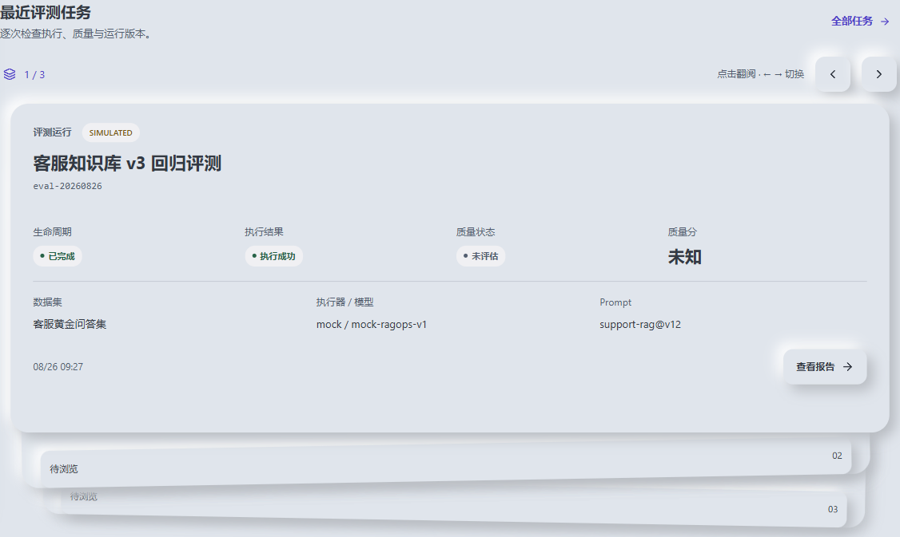
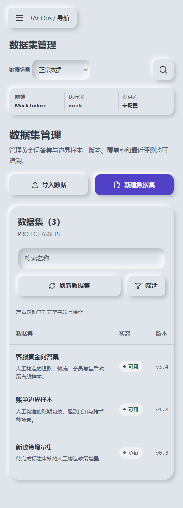

# RAGOps 新拟物工作台与 Card Stack

WOR-69 将当前五个业务页面、404、导航和共享交互统一为新拟物界面，保留 React Router、类型化 API client、Mock/API 双模式及现有状态语义。本文记录实际实现；独立版本对比、项目设置和真实提供方验证仍不是已交付功能。

## 页面与优先级

| 优先级 | 实际路由 / 入口 | 页面结构与操作 |
| --- | --- | --- |
| P0 | `/projects/:projectId/overview` | 项目操作、运行上下文、最近运行卡片、独立指标、质量趋势与失败分布；刷新、新建评测、报告下钻；技术链路位于工作区末尾。 |
| P0 | `/projects/:projectId/datasets` | 可搜索、筛选、刷新的数据表；创建草稿、示例 JSONL 导入并发布、详情、复制 ID、Mock 归档。 |
| P0 | `/projects/:projectId/evaluations` | 生命周期、执行与质量汇总；数据表、搜索、状态筛选、刷新；创建对话框和终态报告链接。 |
| P0 | `/projects/:projectId/evaluations/:taskId/report` | 执行与质量分轴、质量门、指标、诊断分布、运行快照；样本卡片/表格切换、复核筛选、JSON/Markdown 导出、只读基线上下文。 |
| P0 | `/projects/:projectId/evaluations/:taskId/samples/:sampleId` | 问题、指标、疑似原因、上下文与答案对照、用量、源片段、人工确认/排除；引用定位与复制回答。 |
| P0 | 全局工作台 / 404 | 项目入口、搜索、帮助、运行模式快照；窄屏展开导航，404 返回工作台。 |
| P1（已有入口） | 趋势看板、模型与 Prompt | 趋势跳至概览，详细趋势和运行快照用对话框展示。没有新增独立路由。 |
| 后续范围 | 独立版本对比 / 设置 | 版本对比入口明确说明下一阶段；设置禁用。没有补造基线或连接验证按钮。 |

## 视觉规范

以原附件 `01a07189-3f39-7908-a411-43fc0dda0c66` 的 Neumorphism 主题为准；附件 `01a0718e-2e49-786d-a5dd-e7a7c92498d8` 仅提供空间堆叠和浏览交互。冲突按 issue 的优先级处理。

- 表面为 `#e0e5ec`，提示和状态底色为 `#f0f0f3`；没有纯白/纯黑背景、背景渐变或玻璃模糊。
- 桌面凸起阴影为右下 `8px 8px 16px #b8bcc2` 与左上 `-8px -8px 16px #fff`；手机减为 `4px` 偏移。阴影方向固定。
- 按钮 hover 缩小外阴影，active 变为 inset，按钮自身不位移。输入框从默认 inset `6px` 到 focus inset `2px`。
- 圆角主体 20–24px、输入和按钮 12px；正文 13–14px，核心标题 19–26px。状态使用文字与圆点，颜色仅作辅助。
- 文字调整为 `#333943` / `#535e70`，强调色为 `#5141c7`，避免附件弱文字色在灰表面上对比不足。浏览器脚本计算两种表面上正文、次要文字、强调色和三种语义文字色的 AA 对比度，要求均 ≥4.5:1。
- 共用 `300ms ease-in-out`；`prefers-reduced-motion` 关闭 transition、加载动画与卡片揭牌，保留静态层次。

## Card Stack 关键交互

`CardStack<T>` 同时只挂载最多三层：当前记录、后续两条预览。数据不足三条时按实际数量展示；为空时明确显示暂无记录；单条时禁用前后按钮。不会补造卡片或记录。

顶部显示当前位置/总数、操作提示和 44px 上一项/下一项按钮。支持点击后层预览、方向键、Home/End，并首尾循环。键盘事件只在轮播区域或切换控件处理，不占用记录内部输入、链接的按键。后层预览选中后将焦点还给卡组，按钮切换后保留按钮焦点；位置变化通过 `aria-live` 播报。

用记录 ID 保存选中项，刷新或重排后尽量保留同一记录；筛选移除该项则回到首项。报告卡片与表格共享复核筛选，切换视图不改变筛选。运行卡片不放入 Panel 内，报告样本区也是独立区块，不做卡片套卡片。

后层位移 56/112px，缩放 .97/.94；背景透明度 .85/.65，文字保持不透明。后层浏览条为 48px，缩放后仍有足够的点击高度。桌面 hover 后层向两侧轻微散开，前层上移 8px；不增加卡片阴影。触控设备不依赖 hover，也不要求拖拽手势。

卡片内容高度按断点固定：运行 410/540px，样本 500/680px，避免切换时下方区域跳动。超长内容在卡片内滚动；表格保留完整列，在自身区域滚动，窄屏提供滚动提示。数据表没有强行改成堆叠卡组。

## 共享组件与可访问性

| 组件 | 职责 |
| --- | --- |
| `WorkspaceShell` | 桌面导航收起、窄屏完整导航展开、搜索、帮助、三轴运行状态；路由切换关闭窄屏导航并将焦点送入工作区。 |
| `CardStack` / `TaskStack` / `SampleStack` | 通用轮播交互、运行字段、样本字段与真实链接。 |
| `Panel` / `PageIntro` | 区块和页面层级；复用原有内容与操作。 |
| `Dialog` | 标题关联、初始焦点、Tab/Shift+Tab 循环、Escape/遮罩关闭、页面滚动锁定、触发器焦点恢复。 |
| `StatusBadge` / `MetricCard` | 不改写执行/质量/提供方语义，保留零、未知与未评估。 |
| `PageState` / `Toast` | 加载、空数据、显式错误、部分数据、保留旧列表的刷新失败提示。 |
| `TrendChart` / `FailureChart` | 使用当前记录绘制折线与有标签的条形分布；总数标为诊断记录，空质量趋势不补点。 |

所有主操作支持键盘，焦点使用明确的强调色外轮廓；增加跳至工作区链接与数据表滚动区的可访问名称。没有扩大低透明度文字的使用范围；禁用操作保留禁用语义。移动导航位于正常文档流中展开，避免遮住工作区。

## API 依赖与可视化字段

API client、类型契约与 Mock fixture 未修改。路径前缀仍为 `/api/v1`。

| 来源 | 字段与展示 |
| --- | --- |
| `GET /model-execution/status` | `backendExecutionAdapter`、提供方 `configurationStatus`、`externalCallsEnabled`、`executionAvailable`；前端数据源从 `apiMode` 独立读取。 |
| `GET /datasets` 及原创建/导入/发布接口 | 名称、版本、schema、样本数、覆盖、负责人、更新时间、内容哈希；覆盖未知不补 0。 |
| `GET /evaluation-jobs` 及原创建接口 | `status`、`outcome`、`qualityStatus`、`qualityVerdict`、`qualityScore`、样本计数、执行器、模型/Prompt 快照、创建/完成时间；卡片与表格同源。 |
| `GET /evaluation-jobs/:id/report`、`/samples` | `executionSummary` 与 `qualitySummary` 分开；样本问题、参考/本次回答、运行/质量/复核状态、指标状态、错误、上下文/引用数量。 |
| `PATCH .../samples/:id/review` | 只更新复核；不改写问题、标签、回答与原始证据。 |
| `GET .../report/export` | 保留原 JSON/Markdown 导出流程及模拟标记。 |
| 项目概览现有聚合 | 仅已评趋势点进入折线；失败分布按返回计数绘图。API 模式无独立聚合/趋势接口时保留现有边界提示。 |

`VITE_API_MODE=api` 表示读取项目后端，不表示真实模型已连通。执行成功不推导质量通过或 100 分。用量、成本、模型身份、质量分未知时保持未知；未评指标显示未评估；引用解析不等于语义支持。

## 验收与截图

复现命令、测试结果和未验证项见 [WOR-69 验收记录](../qa/neumorphism-card-stack-acceptance.md)。[截图目录](../qa/screenshots/neumorphism) 保存 Mock/API 的原始浏览器截图与 JSON 检查记录。

